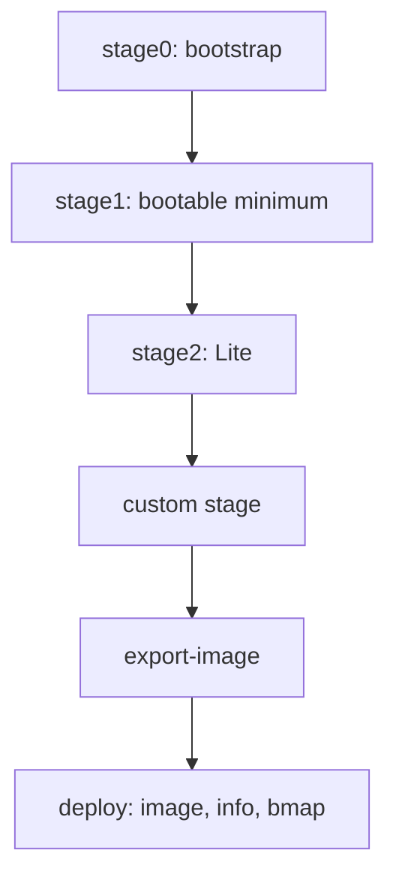

# pi-gen: A Practical Guide to Building Custom Raspberry Pi OS Images

**Repository:** [RPi-Distro/pi-gen](https://github.com/RPi-Distro/pi-gen)  
**Guide snapshot:** 2026-09-14  
**Reviewed source:** `master` commit [`fe2bcb0`](https://github.com/RPi-Distro/pi-gen/tree/fe2bcb0a9e408b36bfd0eec0e8a19cb78293fd95) and `arm64` commit [`86919da`](https://github.com/RPi-Distro/pi-gen/tree/86919dae864359499d8148a49910a558d49a00f1)

This guide explains how `pi-gen` actually works, how to create a maintainable custom image, and how to diagnose failures. It supplements the upstream README; it does not replace checking the branch you are building because Raspberry Pi OS releases and package names change.

## 1. What pi-gen is

`pi-gen` is the collection of Bash scripts Raspberry Pi uses to assemble Raspberry Pi OS images. It does not compile an operating system from source. It:

1. bootstraps a Debian or Raspbian root filesystem;
2. installs and configures packages in ordered stages;
3. copies that filesystem into a partitioned `.img` file;
4. finalizes, cleans, and optionally compresses the image.

Four locations must not be confused:

| Name | Meaning |
|---|---|
| Build host | The Linux computer running `build.sh` or Docker |
| pi-gen source tree | The cloned repository and your custom stage files |
| `ROOTFS_DIR` | A directory containing the future Pi's root filesystem |
| Exported image | The completed boot and root partitions in `deploy/` |

The build is a pipeline, not a normal installer:



Each ordinary stage normally copies the preceding stage's cached root filesystem and changes the copy. This is why `work/` becomes large and why stage caching matters.

## 2. Pick the correct branch first

The CPU architecture is selected by the Git branch, not by a normal `config` setting.

| Desired image | Branch | Base repository | `ARCH` set by code |
|---|---|---|---|
| 32-bit Raspberry Pi OS | `master` | Raspbian | `armhf` |
| 64-bit Raspberry Pi OS | `arm64` | Debian | `arm64` |

For a current 64-bit image:

```bash
git clone --branch arm64 https://github.com/RPi-Distro/pi-gen.git
cd pi-gen
```

For a current 32-bit image:

```bash
git clone https://github.com/RPi-Distro/pi-gen.git
cd pi-gen
```

Do not try to turn a `master` checkout into a 64-bit build by putting `ARCH=arm64` in `config`. The current [`build.sh`](https://github.com/RPi-Distro/pi-gen/blob/fe2bcb0a9e408b36bfd0eec0e8a19cb78293fd95/build.sh) assigns `ARCH=armhf` after reading the config, so that config value would be overwritten.

Use the branch matching the Raspberry Pi OS release as well. The live branches currently target `trixie`. If an existing project was written for Bookworm or Bullseye, use the corresponding historical branch or update and test every package and customization. Merely setting `RELEASE=bookworm` on today's `trixie` branch is not a reliable conversion.

Before changing a working project, record its exact source version:

```bash
git branch --show-current
git rev-parse HEAD
git status --short
```

## 3. Host requirements

### Native build

Native builds are best supported on a current Debian-based Linux system. Install the dependencies listed by the checked-out branch:

```bash
sudo apt update
sudo apt install coreutils quilt parted qemu-user-binfmt debootstrap zerofree zip dosfstools e2fsprogs libarchive-tools libcap2-bin grep rsync xz-utils file git curl bc gpg pigz xxd arch-test bmap-tools kmod
```

The authoritative list is the repository's [`depends`](https://github.com/RPi-Distro/pi-gen/blob/fe2bcb0a9e408b36bfd0eec0e8a19cb78293fd95/depends) file. `build.sh` checks commands, not just Debian package names.

Requirements that commonly surprise people:

- Run the native build as root: `sudo ./build.sh`.
- Keep the source path free of spaces.
- Put `WORK_DIR` on a real Linux filesystem such as ext4. NTFS does not provide all Unix ownership, permission, link, and capability behavior the build needs.
- Reserve tens of gigabytes. Each stage can hold a complete root filesystem.
- The host needs loop-device support.
- A non-ARM host needs `binfmt_misc` and ARM emulation configured.
- A 32-bit `armhf` build requires a 4 KiB host kernel page size. Current `build.sh` checks this explicitly.

Check space and page size before a long build:

```bash
df -h .
df -i .
getconf PAGESIZE
```

### Docker build

Docker isolates the userspace dependencies but still needs privileged access to host kernel facilities, including loop devices and `binfmt_misc`.

```bash
./build-docker.sh
```

Docker is useful on a non-Debian host, but it is not a complete sandbox and does not eliminate kernel compatibility problems. The exact behavior is defined by [`build-docker.sh`](https://github.com/RPi-Distro/pi-gen/blob/fe2bcb0a9e408b36bfd0eec0e8a19cb78293fd95/build-docker.sh) and the [`Dockerfile`](https://github.com/RPi-Distro/pi-gen/blob/fe2bcb0a9e408b36bfd0eec0e8a19cb78293fd95/Dockerfile).

## 4. The configuration file

`config` is sourced as Bash code. It is not an INI file and not merely a passive list of values. Quoting and line endings matter, and command substitutions would execute on the build host.

A practical Canadian 64-bit Lite-derived configuration could look like this:

```bash
IMG_NAME='pinode-os'
PI_GEN_RELEASE='PiNode OS'
RELEASE='trixie'
TARGET_HOSTNAME='pinode'
LOCALE_DEFAULT='en_CA.UTF-8'
KEYBOARD_KEYMAP='us'
KEYBOARD_LAYOUT='English (US)'
TIMEZONE_DEFAULT='America/Edmonton'
WPA_COUNTRY='CA'
FIRST_USER_NAME='pi'
ENABLE_SSH='1'
PUBKEY_ONLY_SSH='1'
PUBKEY_SSH_FIRST_USER='ssh-ed25519 AAAA_REPLACE_WITH_YOUR_PUBLIC_KEY'
PASSWORDLESS_SUDO='0'
DISABLE_FIRST_BOOT_USER_RENAME='0'
ENABLE_CLOUD_INIT='0'
DEPLOY_COMPRESSION='xz'
COMPRESSION_LEVEL='6'
STAGE_LIST='stage0 stage1 stage2 stage-pinode'
```

If you pass another file with `-c`, the normal `config` is read first and the specified file is read afterward. The second file can therefore override values:

```bash
sudo ./build.sh -c config.pinode
```

### Supported general settings

| Setting | Current default | Purpose and warning |
|---|---:|---|
| `IMG_NAME` | `raspios-$RELEASE-$ARCH` | Base image name |
| `PI_GEN_RELEASE` | `Raspberry Pi reference` | Text written to `/etc/rpi-issue`; customize for unofficial images |
| `RELEASE` | `trixie` | Target suite; should agree with the checked-out branch |
| `BASE_DIR` | pi-gen directory | Upstream warns that changing it may break the build |
| `WORK_DIR` | `work/$IMG_NAME` | Stage cache; use a large Linux filesystem |
| `DEPLOY_DIR` | `deploy` | Completed deliverables |
| `DEPLOY_COMPRESSION` | `zip` | `none`, `zip`, `gz`, or `xz` |
| `COMPRESSION_LEVEL` | `6` | `0` through `9`; higher is usually smaller and slower |
| `IMG_DATE` | current date | Prefix for the uncompressed image filename |
| `IMG_FILENAME` | `$IMG_DATE-$IMG_NAME` | Uncompressed `.img` basename |
| `ARCHIVE_FILENAME` | `image_$IMG_DATE-$IMG_NAME` | Compressed archive basename |
| `APT_PROXY` | unset | Temporary build-time apt proxy; removed during export |
| `TEMP_REPO` | unset | Temporary one-line apt source; `RELEASE` text is substituted and source is removed during export |
| `USE_QEMU` | `0` | Produces an image variant intended for QEMU and adds `-qemu` suffix |
| `SETFCAP` | unset | Preserve file-capability handling; use only when the backing filesystem supports it |

`DEPLOY_ZIP` is deprecated. Use `DEPLOY_COMPRESSION`.

### Locale, host, user, and access settings

| Setting | Current default | Purpose and warning |
|---|---:|---|
| `TARGET_HOSTNAME` | `raspberrypi` | Initial hostname |
| `LOCALE_DEFAULT` | `en_GB.UTF-8` | Generated default locale |
| `KEYBOARD_KEYMAP` | `gb` | Console/XKB keymap name |
| `KEYBOARD_LAYOUT` | `English (UK)` | Debconf keyboard layout text |
| `TIMEZONE_DEFAULT` | `Europe/London` | IANA timezone such as `America/Edmonton` |
| `WPA_COUNTRY` | unset | Two-letter regulatory country, such as `CA` |
| `FIRST_USER_NAME` | `pi` | Temporary/initial username; validation permits lowercase names beginning with a letter |
| `FIRST_USER_PASS` | unset | Plaintext build input; account is locked if unset |
| `DISABLE_FIRST_BOOT_USER_RENAME` | `0` | Keep the configured username; requires `FIRST_USER_PASS` |
| `PASSWORDLESS_SUDO` | `0` | Enables passwordless sudo when set to `1` |
| `ENABLE_SSH` | `0` | Enables the SSH service |
| `PUBKEY_SSH_FIRST_USER` | unset | One authorized-key line; does not enable SSH by itself |
| `PUBKEY_ONLY_SSH` | `0` | Disables SSH password login; requires a public key |
| `ENABLE_CLOUD_INIT` | `1` | Installs and seeds cloud-init in the current source |

Security notes:

- Avoid committing `FIRST_USER_PASS` or private material to Git.
- `PUBKEY_SSH_FIRST_USER` must contain a **public** key, never a private key.
- `ENABLE_SSH=1`, `PUBKEY_ONLY_SSH=1`, and a tested public key are safer for repeatable unattended images than a shared password.
- `WPA_COUNTRY` sets the regulatory domain; current pi-gen does not document `WPA_SSID` or `WPA_PASSWORD` as image-build configuration. Use Raspberry Pi Imager customization, NetworkManager provisioning, or cloud-init for network credentials.

### Pipeline settings

| Setting | Current default | Purpose |
|---|---:|---|
| `STAGE_LIST` | `stage*` glob | Ordered list of stages to execute |
| `EXPORT_CONFIG_DIR` | `export-image` | Scripts used to convert an export-marked stage into an image |
| `CLEAN` | unset | With `1`, removes the rootfs of each non-skipped stage before rebuilding it |

The upstream configuration list is in the current [`README.md`](https://github.com/RPi-Distro/pi-gen/blob/fe2bcb0a9e408b36bfd0eec0e8a19cb78293fd95/README.md).

### Docker-only controls

| Setting | Default | Purpose |
|---|---:|---|
| `CONTAINER_NAME` | `pigen_work` | Name of the Docker work container |
| `CONTINUE` | `0` | Reuse an existing Docker container's volumes |
| `PRESERVE_CONTAINER` | `0` | Keep the Docker container after a successful build |
| `PIGEN_DOCKER_OPTS` | empty | Additional `docker run` options |
| `DOCKER` | `docker` | Alternate Docker-compatible command |

Important: `CONTINUE=1` is implemented by `build-docker.sh`, not by the native stage runner. It means “reuse the existing Docker build container,” not “jump directly to the line that failed.” Stage files, caches, `SKIP`, and `CLEAN` determine what actually reruns.

## 5. The standard stages

| Stage | Result |
|---|---|
| `stage0` | Bootstrapped package filesystem; not yet a usable Pi image |
| `stage1` | Bootable minimal console system |
| `stage2` | Raspberry Pi OS Lite; networking, SSH package, Python, hardware tools, and other basics |
| `stage3` | Core desktop system |
| `stage4` | Normal Raspberry Pi OS desktop image |
| `stage5` | Full desktop image with additional applications |

The exact package contents change. Treat the files in your checked-out commit as authoritative, not an old blog post. For example, the current source installs `systemd-timesyncd` in [`stage1/03-install-packages/00-packages`](https://github.com/RPi-Distro/pi-gen/blob/fe2bcb0a9e408b36bfd0eec0e8a19cb78293fd95/stage1/03-install-packages/00-packages).

The current export points are:

- `stage2/EXPORT_IMAGE` gives the `-lite` image.
- `stage4/EXPORT_IMAGE` gives the normal image.
- `stage5/EXPORT_IMAGE` gives the `-full` image.

Stage 3 does not normally export an image.

## 6. Exact execution order

Stages are taken from `STAGE_LIST` or the `stage*` glob. For each stage, `build.sh` does the following:

1. sets `STAGE_WORK_DIR` and `ROOTFS_DIR`;
2. unmounts anything left below the stage work directory;
3. records the stage for export unless `SKIP_IMAGES` exists;
4. unless `SKIP` exists, optionally deletes its rootfs when `CLEAN=1`;
5. runs executable `prerun.sh`;
6. visits subdirectories in shell glob/alphanumeric order;
7. skips any subdirectory containing `SKIP`;
8. processes numbered actions inside each subdirectory;
9. records this stage as the “previous stage,” even if the stage itself was skipped.

For each prefix from `00` through `99`, a substage is processed in this exact order:

1. `NN-debconf`
2. `NN-packages-nr`
3. `NN-packages`
4. `NN-patches/`
5. `NN-run.sh`
6. `NN-run-chroot.sh`

That means `00-packages` runs before `00-run.sh`, while `01-run.sh` runs after all `00-*` actions. The implementation is in [`run_sub_stage()`](https://github.com/RPi-Distro/pi-gen/blob/fe2bcb0a9e408b36bfd0eec0e8a19cb78293fd95/build.sh).

### Recognized control files

| File | Location | Effect |
|---|---|---|
| `SKIP` | Stage | Do not build that stage |
| `SKIP` | Substage | Do not process that substage directory |
| `SKIP_IMAGES` | Stage | Build stage but do not register its `EXPORT_IMAGE` |
| `EXPORT_IMAGE` | Stage | Shell fragment defining image suffix and related export values |
| `EXPORT_NOOBS` | Stage | Requests legacy NOOBS export |
| `prerun.sh` | Stage | Prepares the stage rootfs, normally by calling `copy_previous` |
| `postrun.sh` | Repository root | Optional executable run after all exports finish |

`SKIP_IMAGES` does **not** skip a stage. `SKIP` does **not** automatically redirect the next stage to the most recent built stage. Because even a skipped stage becomes `PREV_STAGE`, skipping an uncached required stage during the first build can lead to:

```text
Previous stage rootfs not found
```

Build the base stages once before using `SKIP` as an incremental-development shortcut.

## 7. Substage file types

### `NN-packages`

Whitespace-separated apt package names. Comments are stripped. Packages are installed in the target rootfs with recommendations:

```text
curl
git
systemd-timesyncd
```

Multiple names may be on one line, but one per line is easier to diagnose and merge.

### `NN-packages-nr`

The same, installed with `--no-install-recommends`:

```text
mosquitto
```

Use this when you deliberately want a smaller dependency set. It can omit something an application silently assumes is present, so test the flashed image.

### `NN-debconf`

Input passed to `debconf-set-selections` before package installation. Use it to answer package configuration questions non-interactively.

### `NN-run.sh`

Runs on the **build host**, not inside the future Pi. It can see the pi-gen source tree and uses `${ROOTFS_DIR}` when modifying the target filesystem.

It must be executable:

```bash
chmod +x stage-pinode/01-config/00-run.sh
```

If it is not executable, pi-gen logs that it was skipped.

Example:

```bash
#!/bin/bash -e

install -v -m 644 files/pinode.conf "${ROOTFS_DIR}/etc/pinode.conf"
install -v -m 755 files/pinode-start "${ROOTFS_DIR}/usr/local/bin/pinode-start"
```

### `NN-run-chroot.sh`

Runs with `/` referring to the future Pi root filesystem. Use normal target paths:

```bash
systemctl enable ssh
systemctl enable systemd-timesyncd
```

The chroot script cannot automatically see your substage's `files/` directory. Copy source files into `${ROOTFS_DIR}` with a preceding host-side `NN-run.sh`, then configure them inside the chroot.

The current runner checks only that `NN-run-chroot.sh` exists; it does not require its executable bit. Keeping shell scripts executable is still sensible for direct testing and clarity.

### `NN-patches/`

Quilt patches applied against the stage work directory. A file named `EDIT` makes the build open an interactive Bash shell for patch work. This is useful for pi-gen source changes, not usually for placing ordinary configuration files into the image.

### `files/`

`files/` has no automatic copy behavior. It is merely a convention. A `run.sh` must explicitly install or copy each required file.

## 8. Variables and helper functions available to scripts

Frequently useful exported variables include:

| Variable | Meaning |
|---|---|
| `BASE_DIR` | pi-gen source directory |
| `STAGE_DIR` | Current stage source directory |
| `SUB_STAGE_DIR` | Current substage source directory |
| `STAGE_WORK_DIR` | Current stage cache directory |
| `ROOTFS_DIR` | Future Pi root filesystem for current stage |
| `PREV_ROOTFS_DIR` | Previous stage's root filesystem |
| `WORK_DIR` | Root of the named image's stage caches |
| `DEPLOY_DIR` | Completed artifacts |
| `FIRST_USER_NAME` | Configured initial user |
| `RELEASE` | Debian/Raspbian suite |
| `ARCH` | Branch-selected target architecture |

Useful exported Bash functions from [`scripts/common`](https://github.com/RPi-Distro/pi-gen/blob/fe2bcb0a9e408b36bfd0eec0e8a19cb78293fd95/scripts/common) include:

| Function | Purpose |
|---|---|
| `log "text"` | Timestamp a message in the build log |
| `copy_previous` | Copy the preceding rootfs into the current stage |
| `on_chroot` | Execute commands inside the target filesystem with required pseudo-filesystems mounted |
| `unmount path` | Unmount nested mounts below a path |
| `update_issue text` | Write build/source identity into `/etc/rpi-issue` |

An unquoted heredoc expands host-side variables before commands enter the chroot:

```bash
on_chroot << EOF
adduser "${FIRST_USER_NAME}" dialout
EOF
```

A quoted heredoc leaves dollar expressions for evaluation inside the chroot:

```bash
on_chroot << 'EOF'
printf '%s\n' "$PATH"
EOF
```

Choose deliberately. Accidental expansion by the host is a common source of empty or incorrect values.

## 9. Recommended custom-stage layout

Keep customization in its own stage instead of scattering edits throughout upstream stages. This makes upstream updates and Git comparisons much easier.

```text
stage-pinode/
├── prerun.sh
├── EXPORT_IMAGE
├── 00-packages/
│   ├── 00-packages
│   └── 01-run-chroot.sh
├── 01-config/
│   ├── 00-run.sh
│   └── files/
│       ├── pinode.conf
│       └── pinode.service
└── 02-first-boot/
    ├── 00-run.sh
    └── files/
        └── pinode-first-boot
```

`stage-pinode/prerun.sh`:

```bash
#!/bin/bash -e

if [ ! -d "${ROOTFS_DIR}" ]; then
    copy_previous
fi
```

Make it executable:

```bash
chmod +x stage-pinode/prerun.sh
```

`stage-pinode/EXPORT_IMAGE`:

```bash
IMG_SUFFIX='-pinode'
if [ "${USE_QEMU}" = '1' ]; then
    export IMG_SUFFIX="${IMG_SUFFIX}-qemu"
fi
```

`stage-pinode/01-config/00-run.sh`:

```bash
#!/bin/bash -e

install -v -m 644 files/pinode.conf "${ROOTFS_DIR}/etc/pinode.conf"
install -v -m 644 files/pinode.service "${ROOTFS_DIR}/etc/systemd/system/pinode.service"

on_chroot << 'EOF'
systemctl enable pinode.service
EOF
```

Make the host script executable:

```bash
chmod +x stage-pinode/01-config/00-run.sh
```

For a custom image based on Lite:

```bash
touch stage2/SKIP_IMAGES
```

and configure:

```bash
STAGE_LIST='stage0 stage1 stage2 stage-pinode'
```

Why both actions are needed:

- `STAGE_LIST` prevents desktop stages from running.
- `stage2/SKIP_IMAGES` prevents an additional plain Lite image from being exported.
- `stage-pinode/EXPORT_IMAGE` exports the rootfs **after** your custom changes.

If the custom stage lacks `EXPORT_IMAGE`, the earlier stage2 export still points to stage2's rootfs, so your custom changes will not appear in that image.

## 10. A first build and an incremental workflow

### Clean first build

```bash
sudo ./build.sh -c config.pinode
```

Watch the native log from another terminal if desired:

```bash
tail -f work/pinode-os/build.log
```

After success:

```bash
ls -lh deploy
sha256sum deploy/*
```

### Rebuild only the last custom stage

First complete one full successful build so stage0, stage1, and stage2 caches exist. Then:

```bash
touch stage0/SKIP stage1/SKIP stage2/SKIP
sudo CLEAN=1 ./build.sh -c config.pinode
```

`CLEAN=1` deletes and rebuilds each **non-skipped** stage. The earlier cached rootfs directories survive because those stages are skipped; the custom stage is recopied from stage2 and rerun.

When finished developing, remove the skip markers before doing a release build from scratch:

```bash
rm stage0/SKIP stage1/SKIP stage2/SKIP
sudo CLEAN=1 ./build.sh -c config.pinode
```

Only remove known marker files like those shown. Do not delete the entire `work/` tree while mounts remain below it.

### Docker continuation

After a Docker failure:

```bash
PRESERVE_CONTAINER=1 CONTINUE=1 CLEAN=1 ./build-docker.sh -c config.pinode
```

This reuses the preserved container volumes. It still reruns whatever your stage markers and `CLEAN` setting select.

## 11. What happens during export

An `EXPORT_IMAGE` file does not immediately save the stage. It registers the stage. After ordinary stages finish, pi-gen runs the separate `export-image` stage once for every registered export.

The current exporter:

1. calculates rootfs size plus a margin;
2. creates an MBR disk image;
3. creates a 512 MiB FAT boot partition and an ext4 root partition;
4. copies the registered stage rootfs;
5. performs `apt-get update` and `dist-upgrade` inside the export rootfs;
6. replaces placeholder boot/root identifiers with the image's PARTUUIDs;
7. initializes initramfs, clears machine identity and logs, and performs cleanup;
8. writes the image, `.info`, optional `.sbom`, and optional `.bmap` artifacts;
9. compresses or copies the result into `deploy/`.

The image may therefore differ slightly from the cached ordinary stage because export performs a final package upgrade. See [`export-image/prerun.sh`](https://github.com/RPi-Distro/pi-gen/blob/fe2bcb0a9e408b36bfd0eec0e8a19cb78293fd95/export-image/prerun.sh) and [`export-image/05-finalise/01-run.sh`](https://github.com/RPi-Distro/pi-gen/blob/fe2bcb0a9e408b36bfd0eec0e8a19cb78293fd95/export-image/05-finalise/01-run.sh).

Typical outputs are:

| File | Purpose |
|---|---|
| `.zip`, `.img.gz`, `.img.xz`, or `.img` | Flashable image |
| `.info` | Build identity plus installed package list |
| `.bmap` | Sparse block map, when `bmaptool` is installed |
| `.sbom.xz` | SPDX JSON software bill of materials, when `syft` is installed |
| `build.log` | Detailed stage log; Docker copies it into `deploy/` |

## 12. Your `ntpdate` failure explained

The error:

```text
Package 'ntpdate' has no installation candidate
However the following packages replace it:
  ntpsec-ntpdate
```

means apt successfully read the configured release repositories, but the package name in your custom file is no longer available as written for that release. This is a target-image package problem, not evidence that `pi-gen` itself cannot tell time.

Find every reference in the project:

```bash
rg -n '\bntpdate\b' .
```

If the only occurrence is this:

```text
stage/02-time/00-packages:ntpdate
```

choose based on what you actually need.

### Recommended: automatic ongoing clock synchronization

Put this in `stage/02-time/00-packages`:

```text
systemd-timesyncd
```

Then enable it in `stage/02-time/01-run-chroot.sh` if another stage has not already done so:

```bash
systemctl enable systemd-timesyncd.service
```

The official current pi-gen already installs `systemd-timesyncd` in stage1, so a Lite-derived current image normally does not need to install it again. Check first:

```bash
rg -n '^systemd-timesyncd$' stage* stage
```

### Only if a script calls the old `ntpdate` executable

Use:

```text
ntpsec-ntpdate
```

Then test the calling script because a replacement package can differ in service integration or options even when it supplies a familiar command.

Do not simply install `systemd-timesyncd` if a later build script literally runs `ntpdate`; `systemd-timesyncd` is a time-synchronization service, not a promise to provide the `ntpdate` command.

## 13. Troubleshooting by the first real error

The final line `Build failed` is only the exit trap reporting a previous failure. Work upward in `build.log` to the first command or apt error.

Useful searches:

```bash
rg -n 'Build failed|E: |ERROR:|not found|No space|Exec format|not executable|Previous stage' work/*/build.log
```

For Docker:

```bash
rg -n 'Build failed|E: |ERROR:|not found|No space|Exec format' deploy/build-docker.log deploy/build.log
```

### Package has no installation candidate

The log line immediately before the apt error identifies the package file being processed. Then:

```bash
sed -n '1,200p' path/from/the/log/00-packages
rg -n 'package-name' .
```

Check all of the following:

- The Git branch agrees with `RELEASE`.
- The package exists for the target suite and architecture.
- An old tutorial has not supplied a renamed or removed package.
- A custom apt repository was configured before the package substage.
- A previous substage did not remove or overwrite apt sources.

Do not blindly substitute the first package apt suggests. Decide whether you need an executable, a daemon, a library, or only behavior now provided by another base package.

### `Previous stage rootfs not found`

Likely causes:

- an earlier stage contains `SKIP` but has never completed;
- `WORK_DIR` changed;
- `IMG_NAME` changed, which changed the default work path;
- a cache was manually removed;
- `STAGE_LIST` contains a custom stage before its required base stage.

List markers and cached roots:

```bash
find stage* -maxdepth 2 -name SKIP -o -name SKIP_IMAGES
find work -maxdepth 3 -type d -name rootfs
```

Remove only the incorrect marker and rebuild the missing base stage.

### `run.sh` is skipped

If the log says a host script is not executable:

```bash
chmod +x path/to/NN-run.sh
git update-index --chmod=+x path/to/NN-run.sh
```

The second command records the executable bit in Git.

### `Exec format error` or `binfmt_misc`

On an x86-64 host:

```bash
sudo modprobe binfmt_misc
sudo update-binfmts --enable
arch-test armhf
arch-test arm64
```

Test the architecture you are actually building. On WSL, `update-binfmts --enable` may be required after startup. Docker still depends on the host kernel for this facility.

### 32-bit build says a 4 KiB page size is required

Check:

```bash
getconf PAGESIZE
```

On a 64-bit Raspberry Pi OS host, the current error message recommends booting the 4 KiB-page kernel via `/boot/firmware/config.txt`. Follow the exact message from your checked-out `build.sh`; kernel filenames and host behavior can change. Alternatively, build the 64-bit `arm64` branch if that is the image you intended.

### No space left on device

Check both blocks and inodes:

```bash
df -h . work deploy
df -i . work deploy
du -sh work/* 2>/dev/null
```

An export can need more temporary room than the final compressed image. The exporter creates a full disk image and a staging tree before compression.

### Loop device, mount, or “device busy” failure

Inspect rather than deleting the work directory:

```bash
findmnt | rg '/pi-gen/|/pinode-os/'
losetup --list
```

Let the build's exit trap unmount its work directories. If it could not, resolve the exact listed mount before removing cache data. Never recursively delete a work path that still contains mounted `/proc`, `/dev`, `/sys`, `/run`, `/tmp`, or image partitions.

### Apt or DNS failure

Distinguish these cases:

- `Temporary failure resolving`: DNS/network problem.
- connection timeout: routing, proxy, repository, or firewall problem.
- `NO_PUBKEY`: repository signing/key configuration problem.
- `404 Not Found`: wrong suite or stale repository path.
- `no installation candidate`: repository metadata loaded but does not offer that package for the target.

`APT_PROXY` is tested by `build.sh` with `curl` before building and is removed from the exported image. `TEMP_REPO` is also removed during export.

### CRLF line-ending problems

Files edited on Windows can acquire carriage returns. Symptoms include `$'\r': command not found`, a bad interpreter, or package names that look correct but fail strangely.

Inspect a suspect file:

```bash
file path/to/script
sed -n 'l' path/to/script | head
```

Convert text files if needed:

```bash
dos2unix path/to/script path/to/00-packages
```

Keep shell scripts and package lists in Git with LF endings.

### A service is enabled but does not run during the build

`systemctl enable` creates boot-time enablement links in the target. Services generally should not be started as if the chroot were a running Pi. Put hardware discovery and machine-specific initialization in a first-boot systemd service, not in the image-build chroot.

### Custom files are absent from the finished image

Check, in order:

1. Did `run.sh` execute, or was it non-executable?
2. Did the script prefix target paths with `${ROOTFS_DIR}`?
3. Did a later stage overwrite the file?
4. Did the exported stage come after the customization?
5. Does the custom stage contain `EXPORT_IMAGE`?
6. Did an old cached custom-stage rootfs survive because `CLEAN=1` was omitted?

Inspect the cached copy first:

```bash
sudo ls -l work/pinode-os/stage-pinode/rootfs/etc/pinode.conf
```

If it is in the cached rootfs but not the flashed image, investigate export selection or a later export-stage change.

## 14. First-boot work

Some operations do not belong in `run-chroot.sh`:

- generating unique SSH host keys;
- discovering a particular Pi's hardware or network;
- expanding or formatting device-specific storage;
- registering the machine with an external service;
- generating per-device secrets;
- any task that requires normal systemd boot ordering.

Use a oneshot service that disables itself after success.

Example unit:

```ini
[Unit]
Description=PiNode first-boot setup
After=network-online.target
Wants=network-online.target
ConditionPathExists=!/var/lib/pinode/first-boot-complete

[Service]
Type=oneshot
ExecStart=/usr/local/sbin/pinode-first-boot
RemainAfterExit=yes

[Install]
WantedBy=multi-user.target
```

The script should create `/var/lib/pinode/first-boot-complete` only after every required operation succeeds. Avoid a marker created at the beginning; that prevents recovery after partial failure.

## 15. Cloud-init in current pi-gen

Current pi-gen defaults `ENABLE_CLOUD_INIT=1`. Stage2 installs `cloud-init` and Raspberry Pi modules, then puts `meta-data`, `user-data`, and `network-config` on the boot filesystem. See [`stage2/04-cloud-init`](https://github.com/RPi-Distro/pi-gen/tree/fe2bcb0a9e408b36bfd0eec0e8a19cb78293fd95/stage2/04-cloud-init).

Choose one clear provisioning model:

- Set `ENABLE_CLOUD_INIT=0` for a traditional fully baked image, or
- keep it enabled and deliberately maintain the seed files.

Leaving an unfamiliar provisioning system enabled can make first-boot networking and user behavior harder to diagnose.

## 16. Safe source-control practice

Maintain your custom image as a Git repository or fork:

```bash
git status --short
git diff --stat
git diff
```

Recommended approach:

- Keep upstream stages as close to upstream as possible.
- Put product changes in a named custom stage.
- Keep secrets out of tracked config files.
- Commit executable bits.
- Record the upstream commit used for each released image.
- Save the generated `.info` and checksum with the released image.
- Rebuild from clean stages before declaring a release reproducible.
- Review upstream changes before merging a new Raspberry Pi OS release.

A simple release record should contain:

```text
Image name:
Build date:
pi-gen branch:
pi-gen commit:
Custom repository commit:
Target Raspberry Pi models:
Image SHA-256:
First-boot test result:
```

## 17. Validation after a successful build

Do not treat “Build finished” as proof the image works on the target hardware.

Minimum validation:

1. Confirm expected files exist in `deploy/`.
2. Record SHA-256 checksums.
3. Flash with verification enabled.
4. Boot on the oldest and newest Pi model you support.
5. Confirm boot completes without an interactive setup surprise.
6. Confirm username and authentication behavior.
7. Confirm SSH host keys are unique.
8. Confirm Ethernet, Wi-Fi regulatory domain, Bluetooth, and time sync.
9. Confirm every custom systemd unit is enabled and healthy.
10. Reboot and confirm services still start.
11. Confirm the root filesystem resized correctly.
12. Run application-specific hardware tests.

Useful target commands:

```bash
cat /etc/rpi-issue
systemctl --failed
systemctl status systemd-timesyncd --no-pager
timedatectl
rfkill
ip address
journalctl -b -p warning --no-pager
```

## 18. Compact command reference

### Clone current 64-bit source

```bash
git clone --branch arm64 https://github.com/RPi-Distro/pi-gen.git
cd pi-gen
```

### Build natively

```bash
sudo ./build.sh -c config.pinode
```

### Build with Docker

```bash
./build-docker.sh -c config.pinode
```

### Find all build controls

```bash
find stage* -maxdepth 2 \( -name SKIP -o -name SKIP_IMAGES -o -name EXPORT_IMAGE -o -name EXPORT_NOOBS \) -print
```

### Find scripts lacking their executable bit

```bash
find stage* -type f -name '*-run.sh' ! -executable -print
```

This specifically checks host-side `*-run.sh` files. The current runner does not require `*-run-chroot.sh` to be executable.

### Find a package or old command name

```bash
rg -n '\bntpdate\b|\bold-package-name\b' .
```

### See the first useful errors

```bash
rg -n 'E: |ERROR:|not found|No space|Exec format|Previous stage' work/*/build.log
```

### See image outputs

```bash
ls -lh deploy
sha256sum deploy/*
```

## 19. Source map

These upstream files are the primary authority for this guide:

- [README and supported configuration](https://github.com/RPi-Distro/pi-gen/blob/fe2bcb0a9e408b36bfd0eec0e8a19cb78293fd95/README.md)
- [Stage runner and environment setup](https://github.com/RPi-Distro/pi-gen/blob/fe2bcb0a9e408b36bfd0eec0e8a19cb78293fd95/build.sh)
- [Common chroot, copy, mount, and bootstrap helpers](https://github.com/RPi-Distro/pi-gen/blob/fe2bcb0a9e408b36bfd0eec0e8a19cb78293fd95/scripts/common)
- [Dependency checker](https://github.com/RPi-Distro/pi-gen/blob/fe2bcb0a9e408b36bfd0eec0e8a19cb78293fd95/scripts/dependencies_check)
- [Docker build wrapper](https://github.com/RPi-Distro/pi-gen/blob/fe2bcb0a9e408b36bfd0eec0e8a19cb78293fd95/build-docker.sh)
- [Image creation and sizing](https://github.com/RPi-Distro/pi-gen/blob/fe2bcb0a9e408b36bfd0eec0e8a19cb78293fd95/export-image/prerun.sh)
- [Final image cleanup and artifacts](https://github.com/RPi-Distro/pi-gen/blob/fe2bcb0a9e408b36bfd0eec0e8a19cb78293fd95/export-image/05-finalise/01-run.sh)
- [Current 32-bit bootstrap source](https://github.com/RPi-Distro/pi-gen/blob/fe2bcb0a9e408b36bfd0eec0e8a19cb78293fd95/stage0/prerun.sh)
- [Current 64-bit branch](https://github.com/RPi-Distro/pi-gen/tree/86919dae864359499d8148a49910a558d49a00f1)
- [Current cloud-init integration](https://github.com/RPi-Distro/pi-gen/tree/fe2bcb0a9e408b36bfd0eec0e8a19cb78293fd95/stage2/04-cloud-init)

Because the repository evolves, recheck the current branch before relying on defaults, package lists, or export behavior in a future build.
